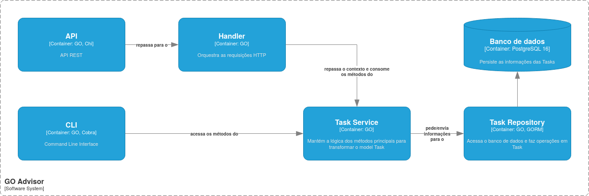

# GO-Advisor
## Resumo
O objetivo deste projeto é entender as peculiaridades da linguagem GO e alguns outros aspectos auxiliares de códigos rodando em ambientes de produção. Portanto, a ideia principal é aprender:

1. Linguagem GO
2. Arquitetar um sistema com mais de um input (CLI e API)
3. Construção de uma API REST
4. Documentação OpenAPI da API usando Swagger
5. Implementação de testes unitários
6. Pipelines de CI/CD
7. Análise e garantia de qualidade de código usando o Sonarqube

## Diagramação
### Topologia geral

### Fluxo de criação pela API
